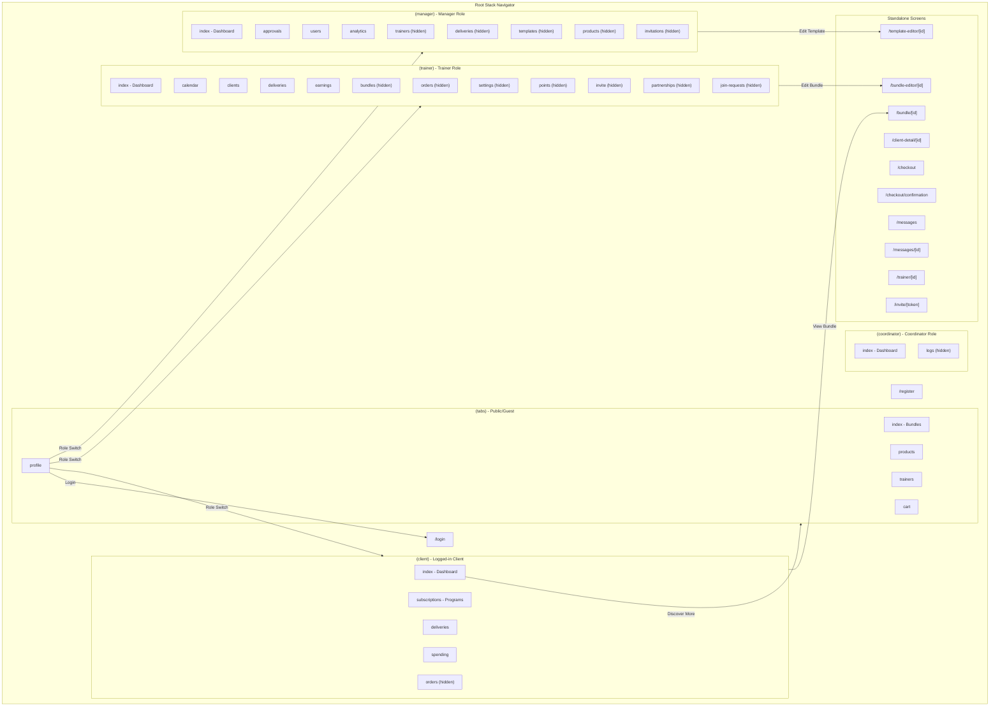
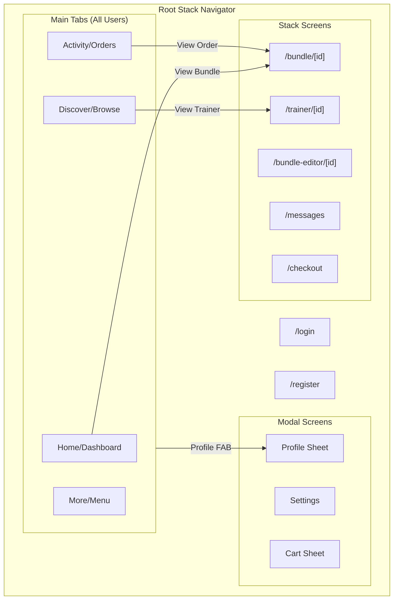

# LocoMotivate Navigation Architecture

> **Note:** This document was created to analyze the current navigation structure and propose simplifications.

## Current Navigation Structure

The app currently has **5 separate tab navigators** that switch based on user role, plus standalone screens. This creates a confusing experience where the bottom navigation changes when navigating between screens.

## Problems Identified

| Problem | Description | Impact |
|---------|-------------|--------|
| **Tab Switching** | "Discover More" navigates from `(client)` to `(tabs)`, changing the entire bottom nav | Confusing UX - users lose their place |
| **Too Many Tab Groups** | 5 separate tab navigators based on role | Complex codebase, inconsistent experience |
| **Hidden Tabs** | Many screens are "hidden tabs" instead of stack screens | Awkward navigation patterns |
| **No Profile FAB** | Profile is a tab, not accessible from other screens | Users must switch tabs to access settings |

## Proposed Simplified Architecture

## Key Changes

1. **Single Tab Navigator** - One consistent bottom nav for all users
2. **Role-Based Content** - Same tabs, different content based on role
3. **Profile FAB** - Floating action button in top-right for profile/settings access
4. **Stack Navigation** - All detail screens use stack navigation (no tab switching)
5. **Cart as Sheet** - Cart accessible via FAB or header button, not a tab

## Implementation Priority

1. Add Profile FAB component
2. Remove "Discover More" tab switching
3. Consolidate tab navigators
4. Move hidden tabs to stack screens
