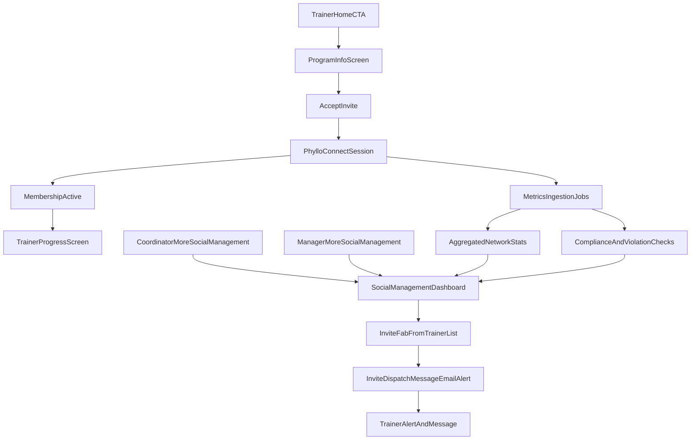

# Phyllo Social Program Integration Plan

## Scope and Outcomes

- Add trainer CTA: **Get Paid for Social Posts** from trainer home banner, routing to program details and enrollment flow.
- Add **Social Management** for coordinator and manager, including cumulative network stats, top performers, concerns/violations, invite FAB, and member controls (pause/ban).
- Implement full trainer lifecycle: invited -> alerted/message/email -> accepted -> Phyllo connect -> active tracking dashboard.
- Use **staging Phyllo environment** and existing `PHYLLO_*` env vars (without exposing token values in client code).

## Product Surfaces to Add/Change

- Trainer home CTA + banner action in [`app/(trainer)/index.tsx`](app/(trainer)/index.tsx).
- Trainer program details screen + commitment requirements from docs:
  - [`docs/Trainer_Campaign_Management_and_Sales.md`](docs/Trainer_Campaign_Management_and_Sales.md)
  - [`docs/Trainer_Social_Media_Business_Summary.md`](docs/Trainer_Social_Media_Business_Summary.md)
- Trainer social status/progress screen (compliance + KPI performance against commitments).
- Coordinator More route addition in [`app/(coordinator)/more.tsx`](app/(coordinator)/more.tsx).
- Manager nav update to include More tab in [`app/(manager)/_layout.tsx`](app/(manager)/_layout.tsx), then Social Management route in manager more screen.
- Coordinator + manager social management desktop screens (same core component, role-aware actions).
- Global users status indicator update in [`app/(manager)/users.tsx`](app/(manager)/users.tsx) and [`app/(coordinator)/users.tsx`](app/(coordinator)/users.tsx).

## Backend/Data Architecture

- Add social-program domain models (new migration under [`supabase/migrations`](supabase/migrations)):
  - `trainer_social_memberships` (trainer_id, status, invited_by, invited_at, accepted_at, paused_at, banned_at, reason).
  - `trainer_social_invites` (state, channel delivery metadata, expiry).
  - `trainer_social_profiles` (platform links, follower totals, avg views/month, phyllo user/account ids).
  - `trainer_social_metrics_daily` (platform-level and aggregate metrics snapshots).
  - `trainer_social_violations` (type, severity, rule reference, evidence, status).
  - `trainer_social_campaign_commitments` + `trainer_social_commitment_progress`.
- Extend server repository and API surface:
  - DB layer in [`server/db.ts`](server/db.ts).
  - tRPC routes in [`server/routers.ts`](server/routers.ts) (or extracted social router module on this branch).
- Add server-only Phyllo client module in [`server/_core`](server/_core):
  - create/reconcile Phyllo user
  - create SDK token
  - fetch account/profile/engagement/income/activity metrics
  - normalize into internal metrics schema

## Invitation + Notification Lifecycle

- Coordinator/manager invite action from Social Management FAB (trainer picker).
- On invite creation:
  - in-app alert entry,
  - system message thread item,
  - outbound email summary.
- Reuse existing message/email patterns from [`server/routers.ts`](server/routers.ts) invite flows; add social-specific templates + deep links.

## KPI/Compliance Modeling (from docs)

- Encode contractual KPIs and watch thresholds from `Trainer_Campaign_Management_and_Sales.md` as rule definitions:
  - posts delivered, on-time posting, tag inclusion, approved creative usage, follower eligibility.
  - views/post, engagement rate, CTR, share/save, intent actions.
- Compute per-trainer and network aggregate statuses:
  - `on_track`, `watch`, `breach`, `paused`, `banned`.
- Show concerns/violations list in social management and trainer progress views with evidence + timestamps.

## UI/UX Componentization Strategy

- Create shared feature module: [`features/social-program`](features/social-program)
  - shared cards (followers/platforms/views/month)
  - top performers table/list
  - concerns/violations panel
  - member management list with pause/ban controls
  - invite FAB + trainer picker modal
- Keep role wrappers thin in `app/(coordinator)` and `app/(manager)`.

## Security and Env Handling

- Use `PHYLLO_*` credentials only in server-side modules.
- Never expose Phyllo credentials or raw SDK token values to client bundles/logs.
- Add token refresh/expiry checks based on `PHYLLO_SDK_TOKEN_EXPIRES_AT` for staging bootstrap and runtime regeneration when needed.

## Delivery Phases

1. **Foundation + Data Model**: migrations, DB functions, social domain router skeleton, env validation.
2. **Enrollment Flows**: trainer CTA/details, invite creation, alerts/messages/email, acceptance status transitions.
3. **Phyllo Connect + Ingestion**: link/connect flow, profile mapping, scheduled metrics ingestion.
4. **Social Management Dashboards**: coordinator/manager screens, top performers, concerns, member controls.
5. **Trainer Progress Experience**: commitment tracking screen and compliance status updates.
6. **Hardening + QA**: role checks, audit trail, accessibility/testIDs, integration tests.

## Validation Checklist

- Trainer sees CTA in home banner and can complete acceptance + connect flow.
- Coordinator/manager can invite, pause, ban, and see social membership badges in global user lists.
- Social dashboards show cumulative live metrics across enrolled trainers.
- Violations are surfaced with actionable statuses.
- Message + email + alert fire correctly on invite.
- No secrets leak to frontend or logs.

### Future limit the social platforms
To reduce cost and hide silly connections for our product I would like to select what media platforms we allow trainers to connect to.  Let's create a screen that we show our preferred platforms and then use the work_platform_id parameter on phyllo api calls to select the propper platforms.  

I would like to have the following platforms available for trainers to connect to.

Youtube
Facebook
Intagram Lite
twitter (X)
tiktok

make sure to mimic their screen (attached) and carefully plan out how to call the api and connect the social platforms.