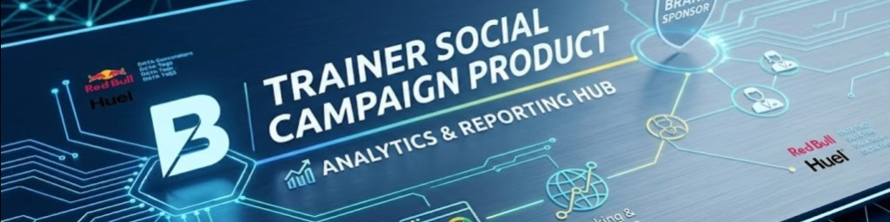
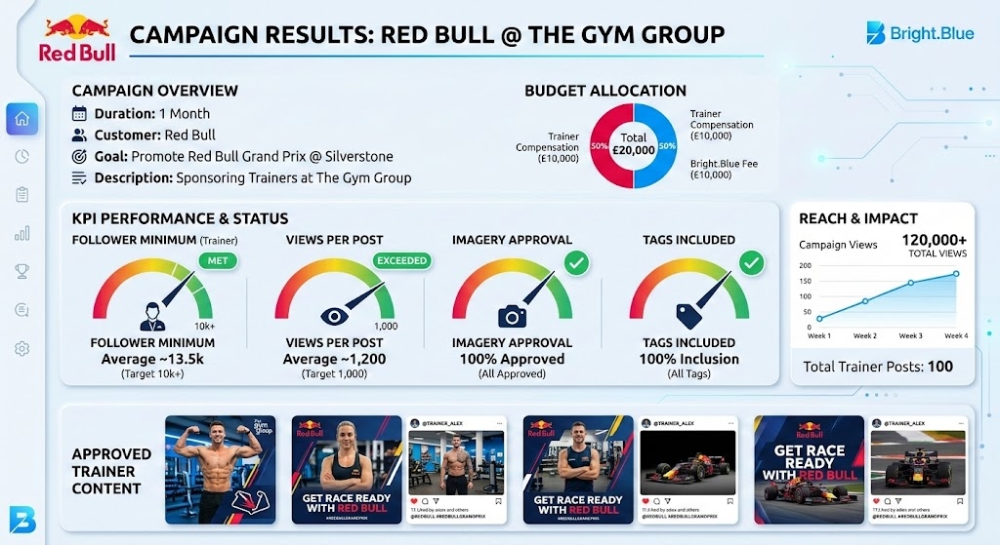
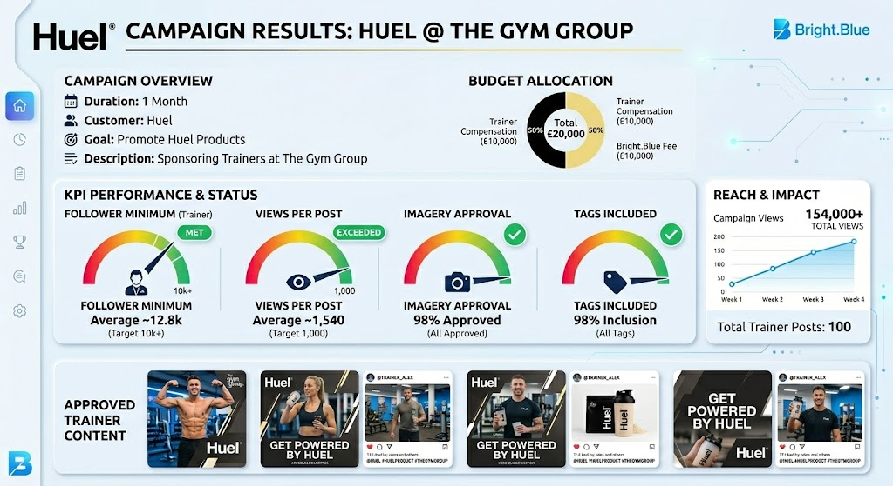

# Trainer Social Campaign Product Update

## Product Overview
Bright.Blue will offer a new campaign product to sell alongside product placement in gyms.  
This campaign product will be sold through the trusted advisor network of trainers.

## Product Components
1. Quote generator for campaigns
2. Results dashboard
3. Campaign management dashboard
4. Campaign tracking and reporting

## Product Sales
Sold via the quote generator alongside current product placement in gyms.

## Product Delivery
The trainer app will include an alert system to notify trainers about campaign opportunities.  
Trainers can sign up directly in-app, receive campaign details, and begin delivery based on campaign requirements.

## Technology to Develop
1. Quote generator
2. Results dashboard
3. Campaign management dashboard
4. Campaign tracking and reporting

---

## Campaign Structure

| Component | Description |
|---|---|
| Duration | Campaign runtime (e.g., 1 month) |
| Customer | Brand sponsor |
| KPIs | Delivery, compliance, reach, engagement, and action metrics |
| Budget | Total campaign budget |
| Trainer Compensation | Payment per approved post |
| Bright.Blue Compensation | Platform fee / share of campaign budget |

---

## Risk Controls and Improvements (v2)

### 1) Contract KPI Framework (Pass/Fail)

#### Delivery KPIs (Contractual)
| KPI | Target | Minimum Pass | Make-Good Trigger |
|---|---|---|---|
| Posts Delivered | 100 | 95 | <95 delivered posts |
| On-Time Posting | 98% | 95% | <95% on-time posts |
| Tag Inclusion | 100% | 98% | <98% tag compliance |
| Approved Creative Usage | 100% | 98% | <98% approved creative |
| Trainer Eligibility (10k+ followers) | 100% | 95% | <95% eligible trainers |

#### Performance KPIs (Optimization)
| KPI | Target | Watch Threshold | Escalation |
|---|---|---|---|
| Avg Views per Post | 1,500+ | <1,000 | creative + trainer swap |
| Engagement Rate | 4.0%+ | <3.0% | content refresh + format test |
| CTR | 1.2%+ | <0.8% | CTA and landing-page update |
| Share + Save Rate | 1.0%+ | <0.7% | hook/creative rework |

#### Business KPIs (Commercial Outcome)
| KPI | Target | Minimum Pass | Review Trigger |
|---|---|---|---|
| Event/Product Intent Actions | Campaign-specific | Defined at quote | <80% of quoted target |
| Cost per Click (CPC) | <= quoted benchmark | +20% variance | pricing and delivery review |
| Cost per Intent Action | <= quoted benchmark | +20% variance | audience and offer review |

### 2) Attribution and Measurement Specification

- **Tracking Standard:** Every campaign uses UTM links + unique QR per campaign and per trainer.
- **Attribution Window:** Default 7-day click / 1-day view.
- **Deduplication Rule:** Last non-direct click within window.
- **Source of Truth:** Bright.Blue campaign results dashboard export.
- **Event Taxonomy:** `impression`, `view`, `engagement`, `click`, `intent_action`, `conversion`.
- **Required Fields:** campaign ID, trainer ID, creative ID, platform, timestamp, geo, link ID, result event.

### 3) Commercial Guardrails (Underdelivery + Make-Goods)

- **Budget Template (GBP20,000 example):**
  - Trainer Compensation Pool: GBP10,000
  - Bright.Blue Platform Fee: GBP10,000
- **Underdelivery Credit:** For contractual KPI misses, apply credit equal to undelivered value.
- **Make-Good Options:** Replacement posts, bonus placements, or future campaign credit.
- **Overdelivery Rule:** Overdelivery may be applied as value-add but not billed unless pre-approved in SOW.
- **Change Control:** Mid-campaign scope changes require written customer approval.

### 4) Compliance and Brand Safety Controls

- **Disclosure:** Paid partnership labeling must comply with ASA/CAP and platform rules.
- **Creative Rights:** Only approved assets with documented usage rights.
- **Brand Safety:** Restricted topics, prohibited claims, and competitor exclusions defined in brief.
- **Review Gate:** Pre-publish creative approval required before campaign goes live.
- **Audit Trail:** Store approval timestamps, versions, and trainer post evidence.

### 5) Operating SLA and Workflow

| Phase | Owner | SLA |
|---|---|---|
| Brief Intake + KPI Lock | Sales + Customer | 2 business days |
| Trainer Matching | Ops | 2 business days |
| Creative Approval | Brand + Bright.Blue | 3 business days |
| Campaign Go-Live Setup | Ops + Product | 1 business day |
| Mid-Campaign Optimization | Ops + Analytics | Weekly cadence |
| Final Reporting Pack | Analytics | 5 business days post-campaign |

- **Late Post Rule:** Auto-reassign after 12-hour miss on scheduled post window.
- **Quality Control:** Daily compliance checks during live campaign.
- **Escalation Path:** Ops -> Sales Lead -> Account Owner.

### 6) Trainer Tiering and Compensation Logic

| Tier | Follower Range | Base Pay/Post | Bonus Eligibility |
|---|---|---|---|
| Starter | 10k-25k | GBP100 | Compliance bonus only |
| Growth | 25k-75k | GBP125 | Compliance + performance bonus |
| Elite | 75k+ | GBP150 | Compliance + performance + premium campaign bonus |

- **Compliance Bonus:** +10% for full campaign compliance.
- **Performance Bonus:** +10-20% for exceeding agreed CTR or intent targets.
- **Penalty Rule:** Repeated non-compliance reduces tier access.

### 7) Dashboard Reporting Schema (Minimum)

- **Delivery Tab:** posts planned vs delivered, on-time %, compliance %
- **Performance Tab:** views, ER, shares/saves, CTR by trainer + creative
- **Business Outcomes Tab:** intent actions, conversions, CPC, CPA
- **Finance Tab:** budget pacing, trainer payout totals, platform fee, make-good/credit log
- **Export:** PDF summary + CSV event-level export

---

## Campaign Examples

### Campaign 1: Red Bull x The Gym Group (Red Bull Grand Prix @ Silverstone)
- **Duration:** 1 month
- **Customer:** Red Bull
- **KPIs:** 1,000 views per post, 10,000 minimum trainer followers, tag included in post, approved imagery used
- **Budget:** £20,000
- **Description:** Red Bull sponsors trainers to promote the Red Bull Grand Prix event at Silverstone
- **Trainer Compensation:** £100 per post
- **Bright.Blue Compensation:** 50% of total campaign budget

### Campaign 2: Huel x The Gym Group (Huel Product Promotion)
- **Duration:** 1 month
- **Customer:** Huel
- **KPIs:** 1,000 views per post, 10,000 minimum trainer followers, tag included in post, approved imagery used
- **Budget:** £20,000
- **Description:** Huel sponsors trainers to promote Huel products
- **Trainer Compensation:** £100 per post
- **Bright.Blue Compensation:** 50% of total campaign budget

---

## Campaign Results

### Campaign 1 Results (Red Bull Grand Prix Event - Silverstone)

| KPI | Result |
|---|---|
| Posts Delivered | 100 (100% of plan at GBP100 per post) |
| Trainer Compliance | 97% (tag + approved imagery + follower threshold check) |
| Total Views | 168,000 |
| Average Views per Post | 1,680 (vs 1,000 KPI minimum) |
| Engagements (Likes + Comments + Shares + Saves) | 7,640 |
| Engagement Rate | 4.55% |
| Shares + Saves | 2,190 (1.30% of total views) |
| Comments | 940 (0.56% of total views) |
| Link Clicks / Event Landing Page Visits | 2,140 (CTR 1.27%) |
| Event Intent Actions (ticket interest / registration clicks) | 482 (22.5% of clicks) |
| Campaign Spend | GBP20,000 |
| Cost per 1,000 Views (CPM) | GBP119.05 |
| Cost per Engagement (CPE) | GBP2.62 |
| Cost per Click (CPC) | GBP9.35 |

**Outcome Summary:** Campaign exceeded delivery and view KPIs, generated strong awareness, and produced measurable event-intent actions.

### Campaign 2 Results (Huel Product Promotion)

| KPI | Result |
|---|---|
| Posts Delivered | 100 (100% of plan at GBP100 per post) |
| Trainer Compliance | 98% (tag + approved imagery + follower threshold check) |
| Total Views | 154,000 |
| Average Views per Post | 1,540 (vs 1,000 KPI minimum) |
| Engagements (Likes + Comments + Shares + Saves) | 6,930 |
| Engagement Rate | 4.50% |
| Shares + Saves | 2,010 (1.31% of total views) |
| Comments | 820 (0.53% of total views) |
| Link Clicks / Product Landing Visits | 2,470 (CTR 1.60%) |
| Product Intent Actions (trial signup / add-to-cart / sample request) | 398 (16.1% of clicks) |
| Campaign Spend | GBP20,000 |
| Cost per 1,000 Views (CPM) | GBP129.87 |
| Cost per Engagement (CPE) | GBP2.89 |
| Cost per Click (CPC) | GBP8.10 |

**Outcome Summary:** Campaign beat core delivery KPIs and drove stronger lower-funnel traffic, with clear product-intent activity for follow-up conversion.
